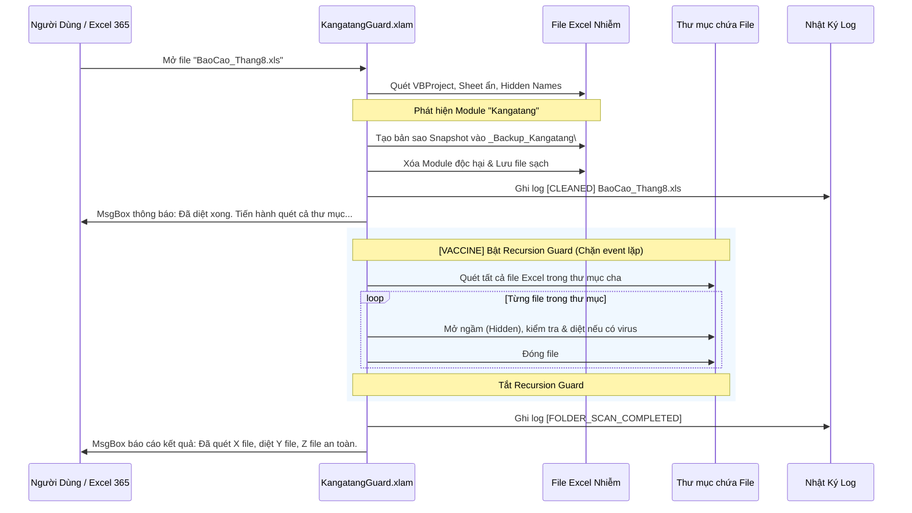

# KẾ HOẠCH NÂNG CẤP KIẾN TRÚC PHÒNG VỆ OFFICE 365 & TỰ ĐỘNG QUÉT THƯ MỤC CHỨA FILE NHIỄM (v3.2.0)
**Mã tài liệu:** `doc/20260903_office365_non_xlstart_defense_plan.md`  
**Phiên bản:** `v3.2.0`  
**Chức danh:** Tech Lead kiêm Senior Full-stack Architect  
**Trạng thái:** Chờ xác nhận từ người dùng trước khi viết code (Awaiting User Confirmation)

---

## 1. BỐI CẢNH & YÊU CẦU NGHIỆP VỤ MỚI

1. **Thích ứng Office 365 không có XLSTART:**
   - Đăng ký kép: Vừa đặt vào `XLSTART`, vừa copy vào `%APPDATA%\Microsoft\AddIns\` và nạp tự động qua Registry `HKCU:\Software\Microsoft\Office\16.0\Excel\Options` (`OPEN*`).
   - Mở rộng phạm vi quét dọn hệ thống: Quét thêm Registry `OPEN*`, `AltStartupPath`, thư mục `AddIns` và `Templates`.
2. **Yêu cầu cải tiến mới (Trigger Scan Parent Folder):**
   - Khi phát hiện một file Excel bị nhiễm virus, sau khi diệt sạch file đó:
     - Tự động kích hoạt quy trình **quét toàn bộ thư mục cha** chứa file đó.
     - Hiển thị thông báo minh bạch cho người dùng (Trước khi quét thư mục & Sau khi hoàn tất quét thư mục).
     - **Bảo vệ chống lặp đệ quy (Recursion Guard):** Chặn đứng nguy cơ treo Excel do sự kiện `WorkbookOpen` lặp vô tận.

---

## 2. BẢNG ĐỐI CHIẾU HIỆN TRẠNG (BEFORE & AFTER MATRIX)

| Tiêu chí | Phiên bản v3.1.0 | Phiên bản v3.2.0 (Nâng cấp) | Giá trị Bảo vệ |
| :--- | :--- | :--- | :--- |
| **Phạm vi phản ứng khi gặp file nhiễm** | Chỉ xử lý duy nhất file vừa mở | **Tự động quét sạch toàn bộ thư mục chứa file đó** | 🛡️ Dập tắt triệt để ổ dịch cục bộ |
| **Thông báo người dùng** | Chỉ thông báo kết quả file hiện tại | **Thông báo 2 tầng:** Báo file nhiễm -> Báo kết quả quét toàn bộ thư mục | ✅ Minh bạch & Tường minh |
| **Cơ chế Nạp Add-in** | Chỉ dựa vào thư mục `XLSTART` | **Đăng ký Kép (Dual Registration):** `XLSTART` + `%APPDATA%\AddIns` + Registry `OPEN*` | 🛡️ 100% nạp được trên Office 365 |
| **Bảo vệ RAM & Cloud** | Chỉ quét khi mở file (`WorkbookOpen`) | **Hook Đa sự kiện:** `WorkbookOpen` + `WorkbookBeforeSave` + `NewWorkbook` | 🛡️ Chống lây qua AutoSave OneDrive |
| **Phạm vi Dọn Ổ dịch** | Quét AppData & XLSTART | Quét thêm `AltStartupPath`, Registry `OPEN*`, `AddIns`, `Templates` | 🛡️ Triệt tiêu mọi vị trí lẩn trốn |

---

## 3. THIẾT KẾ KIẾN TRÚC CHI TIẾT

---

## 4. CÁC MẪU PHÒNG THỦ KỸ THUẬT (VACCINE PATTERNS BẮT BUỘC)

### 🛑 Rủi ro 1: Vòng lặp đệ quy vô tận (Infinite Recursion Loop) khi quét thư mục
- **Cơ chế rủi ro:** Khi Add-in mở các file khác trong thư mục bằng lệnh `Workbooks.Open`, sự kiện `Application_WorkbookOpen` sẽ lại được kích hoạt cho từng file đó, dẫn đến việc kích hoạt quét thư mục lặp vô hạn và làm Excel bị treo cứng (Stack Overflow / Hang).
- 🛡️ **VACCINE 1:**
  - Thiết lập cờ trạng thái toàn cục `Private bIsFolderScanning As Boolean`.
  - Trong sự kiện `xlApp_WorkbookOpen`: `If bIsFolderScanning Then Exit Sub`.
  - Tạm thời tắt `Application.EnableEvents = False` và `Application.ScreenUpdating = False` trong suốt thời gian quét thư mục, hoàn nguyên an toàn trong khối `Finally` / bẫy lỗi.

### 🛑 Rủi ro 2: Quét lặp lại cùng một thư mục trong một phiên làm việc
- **Cơ chế rủi ro:** Nếu người dùng mở liên tiếp 2 file nhiễm nằm cùng một thư mục, việc quét lại toàn bộ thư mục đó lần thứ 2 sẽ gây trễ và phiền toái.
- 🛡️ **VACCINE 2:** Sử dụng `Collection` bộ nhớ lưu trữ các đường dẫn thư mục đã quét gần nhất (`colScannedFolders`). Nếu thư mục đã quét trong vòng 5 phút qua, sẽ bỏ qua việc quét lại.

### 🛑 Rủi ro 3: Người dùng không có quyền ghi trên thư mục (Network Share / Read-Only Folder)
- **Cơ chế rủi ro:** Nếu file nằm trên ổ đĩa mạng chia sẻ chỉ đọc, việc cố tạo thư mục `_Backup_Kangatang\` hoặc ghi file sẽ báo lỗi runtime.
- 🛡️ **VACCINE 3:** Bẫy lỗi tường minh `On Error Resume Next`. Nếu thư mục không có quyền ghi, Add-in thông báo rõ ràng cho người dùng và không làm gián đoạn luồng làm việc.

---

## 5. CÁC FILE SẼ CẬP NHẬT KHI ĐƯỢC XÁC NHẬN

1. **`addin\KangatangGuard_Code.vba`:**
   - Bổ sung hàm `ScanParentFolder(ByVal folderPath As String, ByVal excludeFileName As String)`.
   - Bổ sung cờ chống lặp đệ quy `bIsFolderScanning` và bộ nhớ cache thư mục.
   - Bổ sung hook `xlApp_WorkbookBeforeSave` để bảo vệ chống AutoSave trên OneDrive.
2. **`addin\Install_KangatangGuard.ps1`:**
   - Bổ sung logic copy file vào `%APPDATA%\Microsoft\AddIns\`.
   - Bổ sung ghi Registry `OPEN*` tại `HKCU:\Software\Microsoft\Office\16.0\Excel\Options`.
3. **`addin\Uninstall_Addin.bat`:**
   - Xóa file trong cả 2 thư mục (`XLSTART` và `AddIns`), xóa khóa Registry `OPEN*`.
4. **`Diet_Virus_Kangatang.bat` (v3.2.0):**
   - Bổ sung dọn dẹp các khóa `OPEN*` độc hại và quét `AltStartupPath`.
   - Tự động tạo thư mục `XLSTART` chuẩn nếu máy chưa có.
