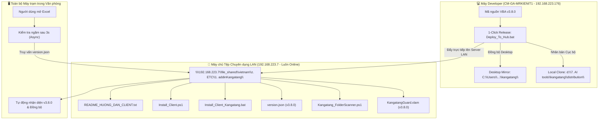

# Tài liệu Kiến trúc v3.8.0: Chuyển đổi Máy chủ Cập nhật sang Server Tệp LAN `\\192.168.223.7` & Cơ chế Clone Kép (Dual-Mirror)
**Mã kiến trúc:** `v3.8.0` | **Trạng thái:** Production-grade | **Ngày hoàn tất:** 09/09/2026  
**Tác giả:** Tech Lead kiêm Senior Full-stack Architect

---

## 1. Bối cảnh & Mục tiêu
- **Thay đổi địa chỉ Hub:** Thay vì dùng máy cá nhân của Tech Lead (`192.168.223.176`) để chia sẻ SMB (dễ gặp vấn đề về bảo mật Windows Guest hoặc phần mềm Antivirus can thiệp), toàn bộ hệ thống phân phối và cập nhật Add-in được chuyển sang **Máy chủ tệp chuyên dụng của công ty**:
  ```text
  \\192.168.223.7\file_shared\vietnam\z. ETC\1. addinKangatang
  ```
- Thư mục này hoạt động liên tục 24/7, được mọi máy tính trong mạng LAN truy cập công khai và ổn định mà không cần nhập mật khẩu.
- **Yêu cầu sao lưu kép (Dual-Mirror):** Mỗi khi biên dịch hoặc sửa đổi mã nguồn, hệ thống tự động:
  1. Đẩy bản phát hành chính thức lên `\\192.168.223.7\file_shared\vietnam\z. ETC\1. addinKangatang` để toàn công ty cập nhật.
  2. Tạo 1 bản clone dự phòng đầy đủ ngay tại máy `192.168.223.176` (`d:\7. AI tools\kangatang\distribution` và Desktop mirror).

---

## 2. Mô hình Kiến trúc Phân phối & Đồng bộ (Dual-Mirror Architecture)



---

## 3. Danh mục Tệp Thành phần

| Tệp | Vị trí Máy chủ LAN 223.7 | Vị trí Clone Cục bộ 223.176 | Chức năng |
| :--- | :--- | :--- | :--- |
| `KangatangGuard.xlam` | Đã triển khai (Read-Only) | `distribution\KangatangGuard.xlam` | File Add-in đã biên dịch |
| `Kangatang_FolderScanner.ps1`| Đã triển khai | `distribution\Kangatang_FolderScanner.ps1` | Worker quét ngoài tiến trình |
| `version.json` | Đã triển khai | `distribution\version.json` | Metadata phiên bản v3.8.0 |
| `Install_Client_Kangatang.bat`| Đã triển khai | `distribution\Install_Client_Kangatang.bat` | Bộ cài 1-Click cho người dùng |
| `Install_Client.ps1` | Đã triển khai | `distribution\Install_Client.ps1` | Logic cài đặt Trust Center & Cache |
| `README_HUONG_DAN_CLIENT.txt`| Đã triển khai | `distribution\README_HUONG_DAN_CLIENT.txt` | Hướng dẫn tiếng Việt cho nhân viên |

---

## 4. Hướng dẫn Dành cho Tech Lead & Người Dùng

### 4.1. Khi phát hành phiên bản mới:
Chỉ cần chạy:
```cmd
Deploy_To_Hub.bat
```
Hệ thống sẽ:
1. Tự động biên dịch mã nguồn VBA mới nhất thành `.xlam`.
2. Tự động tạo `version.json`.
3. Tự động đẩy toàn bộ gói lên máy chủ tệp `\\192.168.223.7\file_shared\vietnam\z. ETC\1. addinKangatang`.
4. Tự động nhân bản (clone) 1 bản lưu tại máy `192.168.223.176` (`distribution` và Desktop).

### 4.2. Khi máy khác trong văn phòng muốn cài đặt:
1. Bấm `Win + R`, nhập:
   ```text
   \\192.168.223.7\file_shared\vietnam\z. ETC\1. addinKangatang
   ```
2. Bấm đúp vào tệp:
   ```text
   Install_Client_Kangatang.bat
   ```
3. Hoàn tất trong 3 giây!
