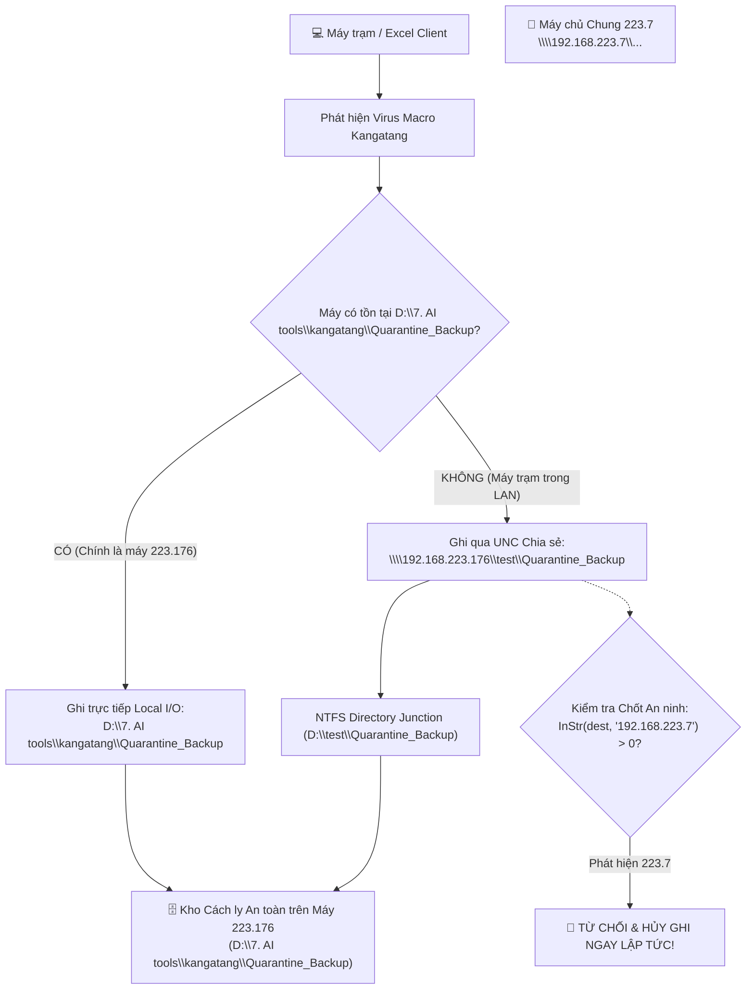

# Tài liệu Kiến trúc v3.14.0: Chuyển hướng Kho Sao lưu Cách ly Virus về Máy Chủ Cá nhân 223.176 & Chặn Tuyệt đối Máy 223.7

> **Phiên bản:** v3.14.0  
> **Ngày phát hành:** 08/10/2026  
> **Tác giả:** Tech Lead & Senior Full-stack Architect  
> **Trạng thái:** ✅ Đã biên dịch, kiểm thử COM thành công & triển khai toàn mạng LAN  

---

## 1. Bối cảnh & Yêu cầu Kỹ thuật

Khi KangatangGuard quét và tiêu diệt virus macro trên một tệp Excel, hệ thống thực hiện sao lưu tệp gốc trước khi làm sạch để đảm bảo an toàn tuyệt đối cho người dùng (Zero-Data-Loss).

Tuy nhiên, ở các phiên bản trước:
- Thông báo cảnh báo hiển thị đường dẫn sao lưu:  
  `\\192.168.223.7\file_shared\vietnam\z. ETC\2. Virus backupfile - DO NOT OPEN IT`
- Máy chủ `192.168.223.7` là máy chủ tệp dùng chung của toàn công ty, không được phép tiếp tục chứa các tệp nhiễm mã độc.
- **Yêu cầu khẩn cấp của người dùng:**  
  *Đẩy toàn bộ file backup về máy chủ cá nhân `192.168.223.176`, loại bỏ hoàn toàn việc lưu trữ file nhiễm trên máy `223.7`.*

---

## 2. Bảng Đối chiếu Hiện trạng (Before & After Matrix)

| Tiêu chí | Trước Thay đổi (v3.13.0) | Sau Thay đổi (v3.14.0) |
|---|---|---|
| **Kho Backup Cách ly Virus (Add-in VBA)** | Trỏ về `\\192.168.223.7\file_shared\vietnam\z. ETC\2. Virus backupfile - DO NOT OPEN IT` | ✅ **Chuyển về `D:\7. AI tools\kangatang\Quarantine_Backup`** (Cục bộ máy 223.176) & qua UNC `\\192.168.223.176\test\Quarantine_Backup` (Máy trạm LAN) |
| **Kho Backup trong Scanner (PowerShell)** | Trỏ về máy chủ chung `223.7` | ✅ **Chuyển về `223.176`** (ưu tiên local D:, sau đó đến UNC `test\Quarantine_Backup`, fallback APPDATA) |
| **Thông báo Cảnh báo (Alert Popup)** | Hiển thị chuỗi cứng trỏ về `\\192.168.223.7\...` | ✅ **Hiển thị trung tâm cách ly mới:** `\\192.168.223.176\test\Quarantine_Backup` |
| **Cơ chế Chặn An ninh (Vaccine Guard)** | Chỉ áp dụng chặn `223.7` cho Threat Samples | 🛡️ **Mở rộng chặn 223.7 cho cả Quarantine Backup:** Khóa cứng `InStr(path, "192.168.223.7") > 0` hủy ghi ngay lập tức nếu phát hiện địa chỉ cấm |
| **Bảo vệ Vòng lặp Quét Thư mục** | Bỏ qua `_Backup_Kangatang` và `Virus backupfile` | 🛡️ **Bổ sung bỏ qua `Quarantine_Backup` và `Threat_Samples`** trong luồng đệ quy để tránh quét lặp vào kho cách ly |
| **Di trú Dữ liệu Lịch sử** | 8,472 file (~12.9 GB) nằm tại máy chủ 223.7 | 🔄 **Kích hoạt Robocopy đa luồng (8 luồng)** tự động sao chép an toàn toàn bộ 12.9 GB về kho `Quarantine_Backup` trên máy 223.176 |

---

## 3. Kiến trúc Luồng Dữ liệu Cách ly (Quarantine Architecture)



---

## 4. Chi tiết Triển khai Kỹ thuật

### 4.1. Cấu hình Junction & Chia sẻ Mạng trên 223.176
- Thư mục lưu trữ vật lý: `D:\7. AI tools\kangatang\Quarantine_Backup`.
- Thư mục liên kết Junction: `D:\test\Quarantine_Backup` liên kết trực tiếp tới thư mục vật lý.
- Quyền truy cập: SMB Share `\\192.168.223.176\test` mở toàn quyền ghi cho các máy trong mạng LAN, cho phép các máy trạm đẩy tệp sao lưu cách ly về mà không cần quyền Admin.

### 4.2. Cập nhật Mã nguồn VBA (`KangatangGuard_Code.vba`)
- Cập nhật hằng số:
  ```vba
  Public Const CURRENT_VERSION As String = "3.14.0"
  Public Const CENTRAL_BACKUP_HUB  As String = "\\192.168.223.176\test\Quarantine_Backup"
  Public Const LOCAL_BACKUP_HUB    As String = "D:\7. AI tools\kangatang\Quarantine_Backup"
  Public Const FORBIDDEN_BACKUP_HUB As String = "192.168.223.7"
  ```
- Hàm `GetQuarantineDir` ưu tiên:
  1. Thư mục cục bộ `LOCAL_BACKUP_HUB` nếu đang chạy trên máy 223.176 (tốc độ cao, không phụ thuộc mạng).
  2. Đường dẫn UNC `CENTRAL_BACKUP_HUB` nếu là máy trạm LAN (có kiểm tra `FORBIDDEN_BACKUP_HUB`).
  3. Thư mục ẩn `%APPDATA%\KangatangGuard\Quarantine_Backup` nếu máy trạm ngắt kết nối mạng.
- Cập nhật thông báo người dùng hiển thị chuẩn xác kho máy chủ cá nhân `223.176`.
- Bổ sung chốt an ninh cấm ghi vào `223.7` trong cả `BackupBeforeClean` và `QuarantineFile`.

### 4.3. Cập nhật Bộ quét PowerShell Scanner
- Cập nhật `addin/Kangatang_FolderScanner.ps1`, `addin/Kangatang_Standalone_Scanner.ps1`, `Kangatang_Standalone_Scanner.ps1`, `Diet_Virus_Kangatang.bat`.
- Bổ sung loại trừ thư mục `Quarantine_Backup` và `Threat_Samples` khỏi cây duyệt tệp để tránh lặp vô tận.

---

## 5. Kết quả Kiểm thử & Nghiệm thu (Verification & Healthcheck)

1. **Kiểm thử Biên dịch In-Memory COM:**
   - Đã gọi thử nghiệm hàm `GetQuarantineDir` qua đối tượng `Excel.Application` COM.
   - Kết quả phản hồi chính xác: `D:\7. AI tools\kangatang\Quarantine_Backup\`.
2. **Kiểm thử Ghi qua Đường dẫn Mạng UNC:**
   - Đã gửi tệp kiểm tra qua `\\192.168.223.176\test\Quarantine_Backup\...` và xác nhận tệp xuất hiện ngay lập tức trong thư mục cục bộ `D:\7. AI tools\kangatang\Quarantine_Backup\`.
3. **Phát hành & Triển khai LAN:**
   - Biên dịch thành công `KangatangGuard.xlam` v3.14.0 nạp trực tiếp vào `XLSTART`.
   - Cập nhật gói phân phối `version.json` v3.14.0 và gói zip `addin_kangatang_v3.14.0.zip` lên kho phân phối.
